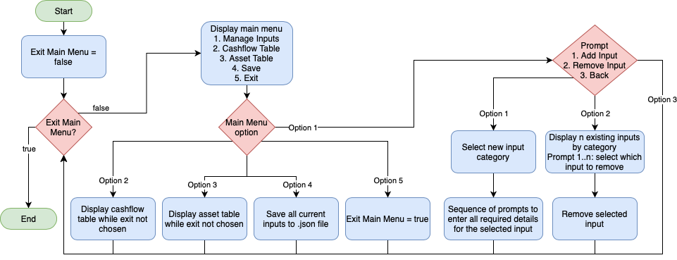
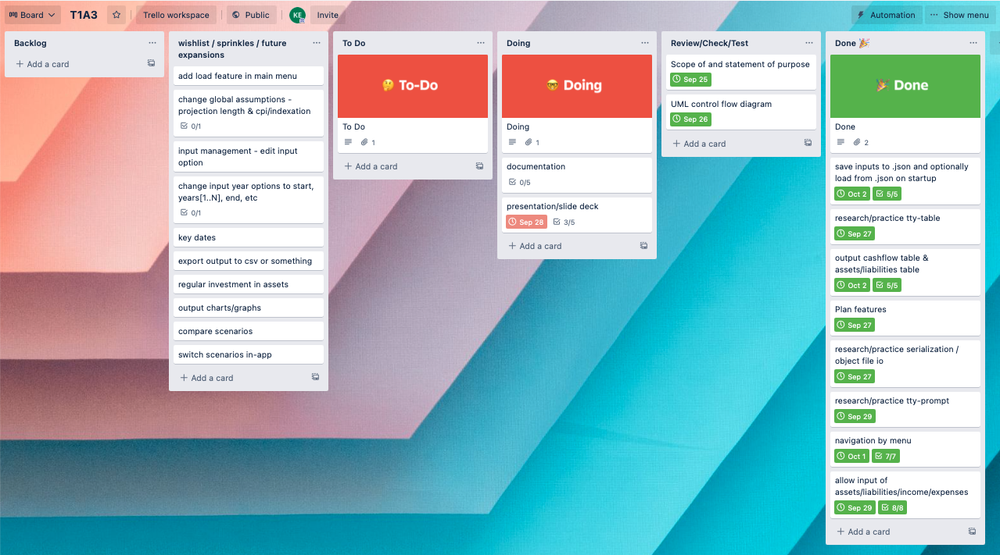

# T1A3 - Financial Projections Terminal App - Koray Eren

## Installation

1. Install Ruby
   * <https://www.ruby-lang.org/en/documentation/installation/>
2. Download Repository
   * <https://github.com/koray-eren/financial_projections_terminal_T1A3>
3. Open the dowloaded repository folder in terminal
4. Install bundler gem
   * `gem install bundler`
5. Run `bundle install` in the repo folder (installs dependencies)
6. Start the app by running `main.rb` or `run_app.sh` in the repo folder
   * `ruby main.rb` OR
     * By default the app will save and load from the directory 'scenario1' inside the repo folder. If running the app via ruby, you may provide an alternative directory name to load from and save to.
       * `ruby main.rb new_folder` will use new_folder as the save and load point within the repo directory, and create it if it does not exist.
   * `./run_app.sh`

### Dependencies

* tty-table
* tty-prompt
* json
* fileutils

### System/Hardware Requirements

* Compatible with Mac OS / Linux / Windows
* Tested and working on Raspberry Pi 2 Model B
  * 1GB RAM
  * 900MHz quad-core ARM Cortex-A7 CPU

## Github Repository

<https://github.com/koray-eren/financial_projections_terminal_T1A3>

## Statement of Purpose

* This application aims to facilitate more informed financial decisions on the part of the user.
* The user can see the long term impact of their current financial position, as well as explore the potential impact of various changes.
* The hope is that this application may offer value to all users regardless of their level of financial literacy.
* Financially savvy users can for example use the app to compare various investments to inform their investment decisions.
* Users with less experience in dealing with finances can use fewer of the available features quite simply to get an idea of their cashflow position and assist in budgeting.
* Both abovementioned use cases however, are applicable to both user groups and can be used by all users without a significant learning curve.

* The application allows the user to enter financial inputs, and project forward these inputs an arbitrary number of years.
* The user can add customisable income, expenses, assets, and liabilities.
* The user can adjust assumptions such as indexation, projection length, and tax rate.
* The customisability of the app also facilitates 'what if' modelling, whereby the user can explore the impact of unexpected financial conditions to their position, particularly negative ones, for example
  * What if a given investment experiences a lower than expected return?
  * What if the user were to lose their income?
  * What if interest rates were to increase?

* There are two main sections to the app - managing inputs & viewing outputs (as well as one or two auxiliary features)
* The user enters their desired inputs, and can view the output derived from them
* Inputs: assets, income, expenses, liabilities
* Outputs: cashflow table, assets & liabilities table

* Both projecting forward their current financial position, and exploring various hypothetical scenarios can help a user answer various important financial questions such as:
  * When can I retire?
  * Which investment attributes are better over the long term?
  * What will my situation look like if interest rates go up?
  * How much can I afford to spend?

## Scope and Limitations

* Compounding is annual for all projections, and other compounding options are not provided
* All calculations are start of period.
* This calculator does not include any form of social security benefits.
* This calculator does not attempt to calculate income tax as per the relevant legislation. Instead, tax is applied at a flat rate of 30%. In the vast majority of cases, users' average tax rate (actual tax paid expressed as a percentage of their total taxable income) will be below 30%
* Any cashflow surplus is assumed spent, and any cashflow deficit is assumed to represent a reduction in expenses (i.e. is not accounted for).
* Liabilities are assumed to be interest only

## Features

* Allows user to input assets, liabilities, income, and expenses
  * The user can enter an arbitrary number of each the 4 input types. The inputs will be used to derive the outputs described below.
  * Attributes of the inputs
    * Asset: Name, Value, First Year, Growth Rate, Income Rate, Sale Year
    * Liability: Name, Value, First Year, Interest Rate, Deductible, Principal Repayments (optional)
    * Income: Name, Value, First Year, Last Year, Taxable
    * Expense: Name, Value, First Year, Last Year, Deductible
  * Assets and Liabilities can may have a First Year value of 0, indicating an existing asset/liability. If First Year is a non-zero value then the relevant cashflow will also be applied, e.g. a First Year value of 1 for an asset will add an expense to year 1 to account for the asset's purchase.
  * Similarly, if an asset has a non-zero Sale Year value, income from the asset's sale will be included in the cashflow, and taxed.
* Derive long term cashflow projection table from inputs
  * Cashflow projections show a 10 year table containing all income and expenses from the users inputs (including income and expenses associated with assets and liabilities where applicable).
* Derive long term assets and liabilities projection table from inputs
  * Shows a 10 year table containing all assets and liabilities from the users inputs.
* Save all inputs to .json files
  * Prompts the user whether or not to save upon exit.
  * Saves to either the default, or specified scenario.
* Optionally load saved files on start up
  * By default the program will load any files in 'scenario1', but the user may specify a new scenario name when starting the program.

## User Experience

* Inputs - a series of scrollable menus, using enter to select the relevant option.
  * Input management is segregated by input type, and all existing inputs for the selected category are displayed.
  * The user can then select to either add, remove (if applicable), or edit (if applicable) a selected input, or go back to the previous menu.
  * The sections requiring user input were designed with robustness in mind, and to this end, limiting the users options for entering incorrect information. If for example a user enters a non-numerical character when the prompt for input value is active, they will not be able to proceed until they enter a valid numerical value.
* Outputs - Cashflow and Assets & Liabilities
  * The option to display these tables is on the main menu, making it very simple to load a previous scenario and viewing output immediately.
  * Output will be shown until user presses space or enter to return to main menu.
  * A prompt is shown on screen to this effect.
  * The table is printed with the Gem tty-table to enhance the readability.
* Errors in input are handled by asking the user to input the data in the correct format. This application aims to limit the opportunities for the user to generate errors by strictly specifiying/limiting acceptable input types, for example using a slider on a spectrum of acceptable values rather than accepting plain integer input. Potential errors may occur when trying to load .json files that don't exist, and this handled by creating the specified directory if it does not exist.

## Diagram

Changes to final implementation compared to diagram above:

* Instead of having the user manually select the save option prior to exiting, the program now asks the user if they want to save every time the program exits. This again, minimises the risk that the user may erroneously forget to save.
* Instead of having the inputs management menu ask whether to add or remove in first instance, the menu now prompts the user to select a category first - i.e. asset/liability/expense/income, and then proceeds to the input management menu.
* An 'edit' option was added to the input management menu, which simply combines remove an input + add a new input. This simplifies the user process in the event they made a mistake on an existing input.
* The Edit and Remove options are only shown if instances of the selected input type already exist. This again, minimises potential for user error.

## Implementation Plan

Implementation plan done on Trello: <https://trello.com/b/lJhx7RbX/t1a3>

## History

Extremely basic project structure existed as at 23/09/21. This contained only main.rb, 3 classes (Income, Expense, Liability), and an Asset class with only an initialize method, and a few attributes. On 23/09/21 T1A3 project idea was approved by educator, and existing project was changed to T1A3 project.
